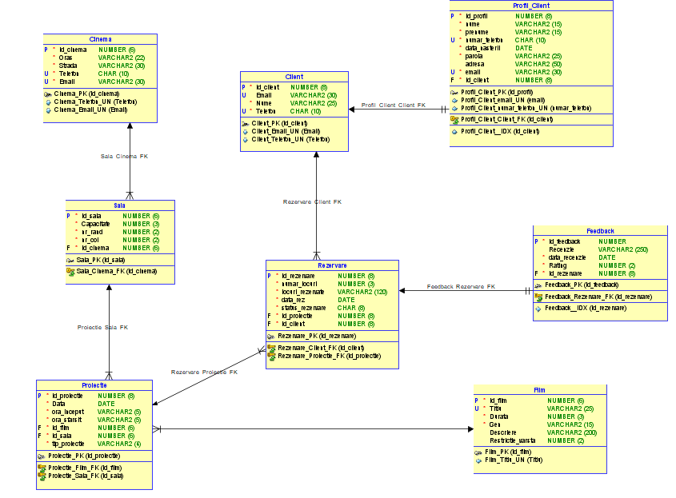

# 🎬 Sistem de Gestiune Cinematograf (Cinema Management System)

Acest proiect reprezintă o soluție completă de bază de date pentru administrarea unui lanț de cinematografe. Sistemul permite gestionarea locațiilor, a sălilor de proiecție, a programului de filme, a clienților și a procesului de rezervare, integrând totodată un sistem de feedback.

Proiectul a fost dezvoltat utilizând **Oracle SQL Developer Data Modeler** pentru proiectarea logică și relațională, urmată de implementarea fizică în **Oracle Database 11g**.

---

## 🖼️ Schemele Proiectului

### Modelul Logic

### Modelul Relațional

---

## 🚀 Caracteristici Principale

* **Gestiune Multi-Locație:** Administrarea mai multor cinematografe și a sălilor aferente acestora.
* **Programare Proiecții:** Control riguros asupra intervalelor orare pentru filme, evitând suprapunerile în săli.
* **Sistem de Rezervări:** Permite clienților să rezerve locuri specifice (format R-C) pentru proiecții viitoare.
* **Profiluri Clienți:** Gestionarea datelor personale, adreselor și securizarea prin parole.
* **Analiză și Feedback:** Colectarea recenziilor și rating-urilor (1-10) pentru experiența de vizionare.

---

## 🏗️ Arhitectura Bazei de Date

Baza de date este compusă din **8 tabele interconectate**, respectând regulile normalizării (**1NF, 2NF, 3NF**) pentru a asigura integritatea datelor și eliminarea redundanței.

### 📊 Tabele și Relații

* **Cinema:** Stochează locația și datele de contact ale cinematografelor.
* **Sala:** Detalii despre capacitate, rânduri și coloane, aparținând unui cinema (relație 1:N).
* **Client & Profil_Client:** Separarea datelor de bază de detaliile extinse ale profilului (relație 1:1).
* **Film:** Catalogul de filme cu detalii despre gen, durată și restricții de vârstă.
* **Proiectie:** Entitatea centrală care leagă filmele de săli și intervale orare (relație 1:N).
* **Rezervare:** Gestionează locurile ocupate de clienți pentru proiecții specifice.
* **Feedback:** Recenzii oferite de clienți pentru rezervările efectuate (relație 1:1).

---

## 🛠️ Detalii de Implementare (Constrângeri și Triggere)

Sistemul include logică de business avansată implementată direct la nivelul bazei de date prin Triggere și Check Constraints:

### Validarea Datelor
* **Format Contact:** Verificarea numerelor de telefon (RO: 07xx) și a adreselor de email prin expresii regulate.
* **Restricții Vârstă:** Valori predefinite (3, 7, 12, 15, 18 ani) pentru filme.
* **Rating:** Punctaj obligatoriu între 1 și 10 pentru feedback.

### Automatizare și Integritate
* **Auto-Increment:** Utilizarea secvențelor (`SEQUENCE`) și a triggerelor pentru generarea automată a ID-urilor.
* **Integritate Temporală:** Triggere care asigură că datele proiecțiilor și rezervărilor sunt întotdeauna în viitor.

### Prevenirea Erorilor de Programare
* **Trigger `verifica_durata_film`:** Verifică dacă durata filmului se încadrează în intervalul orar al proiecției.
* **Trigger `verifica_suprapunere_proiectie`:** Împiedică programarea a două filme în aceeași sală în același timp.
* **Trigger `verifica_loc_unic`:** Garantează că un loc nu poate fi rezervat de două ori pentru aceeași proiecție.

---

## 📋 Cerințe Sistem

* **SGBD:** Oracle Database 11g sau mai nou.
* **Tool Recomandat:** Oracle SQL Developer / Data Modeler.

---

## 🧑‍💻 Autor

* **Student:** Dumitriu Denis-Gabriel, Grupa 1311A.
* **Coordonator:** Mironeanu Catalin.

---

## 📄 Documentație Completă

Pentru detalii tehnice aprofundate privind pașii normalizării și structura detaliată a fiecărei coloane, consultați fișierul **DocumentatiePDF.pdf**.
